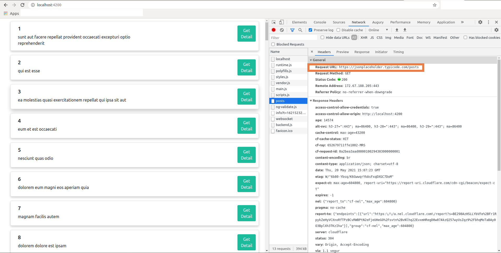
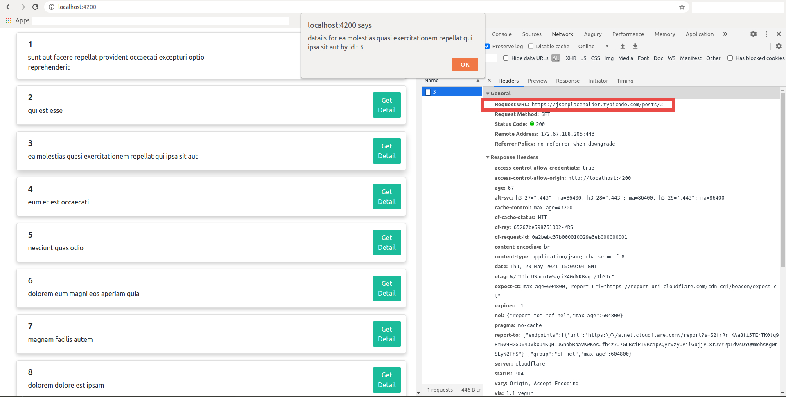

# Angular Interceptor Example

Interceptors provide a way to **intercept HTTP requests and responses to transform or handle them before passing** them along. This application is about how to implement interceptor and intercept any request.


### 1 Create Interceptor 

- To create interceptor we have to implement the interface `HttpInterceptor` and override the method `intercept()`,which has two parameters **HttpRequest** and **HttpHandler**.


```js
@Injectable()
export class CustomInterceptor implements HttpInterceptor {
    
    jsonPlaceHolderUrl: string;

    constructor() {
        //get base url from environment profile
        this.jsonPlaceHolderUrl = environment.jsonPlaceholder;
    }

    intercept(reqest: HttpRequest<any>, next: HttpHandler) {
        //intercept and modify request before sending to the backend server
        const httpsReq = reqest.clone({ url: this.jsonPlaceHolderUrl + reqest.url });    //addding 'https://jsonplaceholder.typicode.com/' to all outgoing request
        return next.handle(httpsReq);   //send request after modifying
    }
}
```
- An interceptor may handle the request entirely, and compose a new event stream instead of invoking `next.handle()`.
 
- And add the custom-created interceptor to list `HTTP_INTERCEPTORS` to provide in the application.

```js 
 providers: [{ provide: HTTP_INTERCEPTORS, useClass: CustomInterceptor, multi: true }]
```


### 2 Intercepted Requests

- Interceptor will convert request to 'https://jsonplaceholder.typicode.com/posts' that called below  before sendig to backend server: 
```js
getPosts(): Observable<PostModal[]> {
   this.http.get<PostModal[]>("posts");    
   }
```



- Interceptor will convert request to 'https://jsonplaceholder.typicode.com/posts/id' that called below  before sendig to backend server: 


```js
 getPostDetail(id: number) {
    return this.http.get<PostModal>(`posts/${id}`) 
  }
```




### 3 Steps To Clone It

```
git clone https://github.com/dhruv-rank/angular-9-interceptor-example
cd angular-9-interceptor-example
npm install
```

#### 3.1 To Run On Local-Server :
```
ng serve
```
And start with http://localhost:4200

#### 3.2 Production Build 

Command to build an application for **production** :

```
ng build --prod --aot=true --build-optimizer=true
```
- --prod flag is added to use production environment profile at build time.  
- The Angular '**aot**' compiler converts your Angular HTML and TypeScript code into efficient JavaScript code during the build phase before the browser downloads and runs that code. Compiling your application during the build process provides a faster rendering in the browser.
- The build-optimizer makes it easier for code minifiers to remove unused code by removing Angular-specific decorators, constructor parameters.


